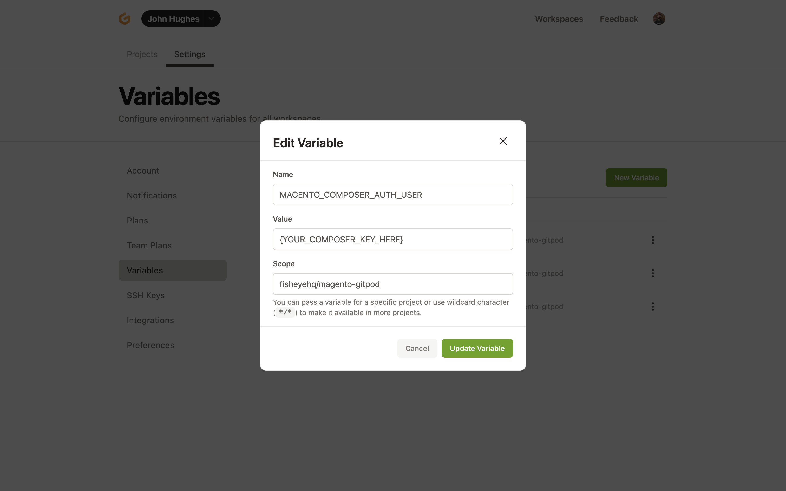

# Magento 2 Demo Gitpod Cloud Environment

Spin up a demo Magento Open Source instance, in the cloud, [in one click](https://gitpod.io/#https://github.com/fisheyehq/magento-gitpod).

## Overview

This repository contains a Gitpod configuration for a Magento 2 cloud environment that can be used for multiple purposes, such as:
* To demo sites to merchants during sales pitches
* To provide merchant training sessions
* Quick access to a blank Magento instance to test/debug default configuration options
* For a demo instance to help revise for Adobe Commerce certifications (e.g. Business Practitioner)
* For a quick, disposable development environment to 'hack around' on (great for developer training sessions)
* For those new to Magento 2 to quickly get hands-on and play around with the platform

## Key Benefits/Features
* Environments are quick to create (~5 mins) and even faster to restart, once created, after being stopped (<20 seconds)
* Each environment allows you full access to the storefront, admin panel, codebase, command line and more, and can even be connected to VS Code or PHP Storm remotely
* Everything is cloud hosted, so it takes up no space or resource on your machine (bar another browser tab)
* Each environment has it's own dedicated URL, which you can share others so they can access too (e.g. merchants and colleagues)
* You can create, run (and destroy) as many environments as you like in parallel
* Gitpod's free tier provides you 50 hours of uptime across all environments
* After 30 minutes of inactivity your instance will be turned off to save your usage time
  
## Getting Started

### Prerequisites
* Ensure you have a GitHub account and are logged in
* Install and enable the ([Gitpod browser extension](https://www.gitpod.io/docs/browser-extension))
* Ensure you have the relevant licence keys to hand (for Adobe Commerce only)

### Magento Open Source:
1. Navigate to the default `open-source` [branch here](https://github.com/fisheyehq/magento-gitpod/tree/magento-open-source) (or stay on the main repo page) and click the 'Gitpod' button, or simply visit [https://gitpod.io/#https://github.com/fisheyehq/magento-gitpod](https://gitpod.io/#https://github.com/fisheyehq/magento-gitpod)

### Adobe Commerce:
1. Create a free Gitpod account by linking your GitHub account: [https://gitpod.io/login/](https://gitpod.io/login/)
2. Add variables to your account at [https://gitpod.io/variables](https://gitpod.io/variables) for `MAGENTO_COMPOSER_AUTH_USER` and `MAGENTO_COMPOSER_AUTH_PASS` with composer credentials that have access to the Adobe Commerce repos and set the Scope to `fisheyehq/magento-gitpod`\*

3. Navigate to the `adobe-commerce-b2b` [branch here](https://github.com/fisheyehq/magento-gitpod/tree/adobe-commerce-b2b) and click the 'Gitpod' button, or simply visit [https://gitpod.io/#https://github.com/fisheyehq/magento-gitpod/tree/adobe-commerce-b2b](https://gitpod.io/#https://github.com/fisheyehq/magento-gitpod/tree/adobe-commerce-b2b)

> \*Note: you must supply your own composer credentials to allow install of Adobe Commerce. The default credentials in this repo support Magento Open Source only.

## Accessing the Magento Admin Panel
The Magento Admin Panel is is available at `/admin` and the username and password are `admin` and `password1` respectively.

## Modifying Configuration
The environments allow for multiple different configuration settings that can be overridden, including (but not limited to):
* Installation of Magento Open Source or Adobe Commerce
* Installation of sample data
* Magento version to install
* Composer credentials
* PHP/MySQL/Nginx/Redis etc, versions
* Enabling Xdebug
* Change the admin username and password

> To see a full list of environment variables that can be overridden see all lines that begin with `ENV ` in the [.gitpod.Dockerfile](https://github.com/fisheyehq/magento-gitpod/blob/magento-open-source/.gitpod.Dockerfile) file.

### Overriding Environment Variables

There are multiple ways to override environment variables, [which are outlined in this guide](https://www.gitpod.io/docs/environment-variables), and which option you should choose depends on whether you want to override the configuration for a specific environment only, or every environment you create with Gitpod.

#### Global Overrides
To override values for all environments, which is recommended if you want to override composer crendtials to allow installation of Adobe Commerce, see the Adobe Commerce set up steps above (under 'Getting Started') to add variables to your account at [https://gitpod.io/variables](https://gitpod.io/variables). You may also wish to use this to always enable Xdebug, for example.

#### Per Environment Overrides
There are some settings that you may want to override for a specific environment only, such as whether you want to install sample data, or change the version of Magento installed. You can do this by passing the environment variables as part of the URL to initiate the environment build.

All the 'Gitpod' button on GitHub does is direct you to a special Gitpod URL that includes the GitHub repo URL. For example, on this repo the URL is `https://gitpod.io/#https://github.com/fisheyehq/magento-gitpod`.

To override variables, they need to included between `https://gitpod.io/#` portion of the URL and the the repo URL itself.

For example to install Magento 2.4.4 (managed by the `MAGENTO_VERSION` variable) and disable the installation of sample data (managed by the `INSTALL_SAMPLE_DATA` variable) you'd construct and visit the following URL:

[https://gitpod.io/#MAGENTO_VERSION=2.4.4,INSTALL_SAMPLE_DATA=NO/https://github.com/fisheyehq/magento-gitpod](https://gitpod.io/#MAGENTO_VERSION=2.4.4,INSTALL_SAMPLE_DATA=NO/https://github.com/fisheyehq/magento-gitpod)

> Note: for security reasons, do not pass sensitive information (such as composer credentials) as URL parameters. Always use the [https://gitpod.io/variables](https://gitpod.io/variables) page in your account instead.

## Roadmap
- [x] Magento Open Source support
- [x] Adobe Commerce support (and allow overriding of composer credentials)
- [x] Add Magento sample data
- [x] Install and enable B2B for the Adobe Commerce build
- [ ] Add Hyvä Themes support and configuration options
- [ ] Add Adobe Live Search and Product Recommendations to the Adobe Commerce build
- [ ] Add useful, often used solutions for demo purposes, e.g. Elasticsuite, ShipperHQ, Braintree etc.

> Further roadmap suggestions and pull requests welcome.

## Credit
Based on the original Gitpod development environment and config produced by
* https://github.com/develodesign/magento-gitpod
* https://github.com/nemke82/magento2gitpod
